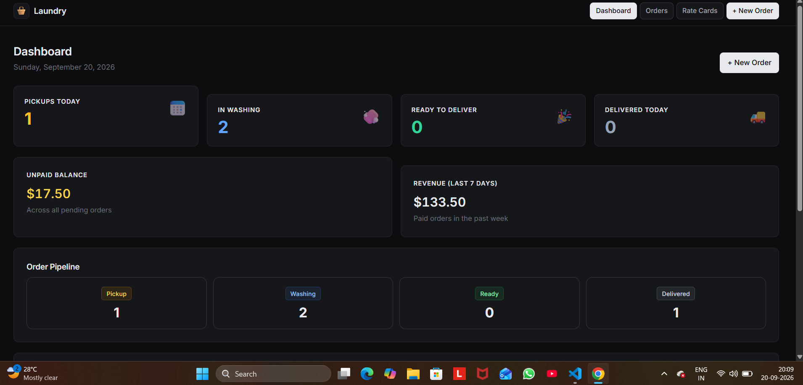
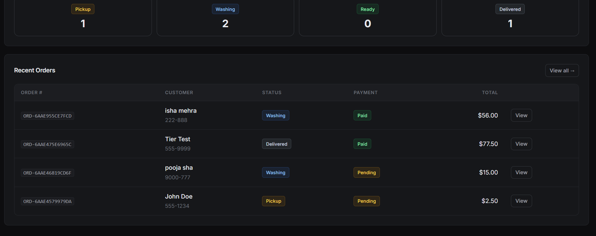
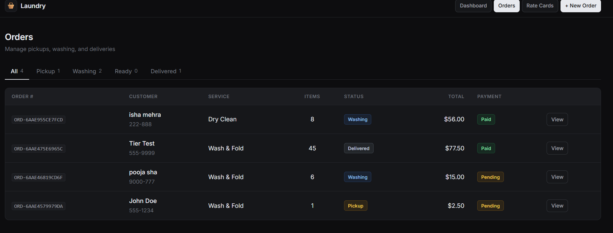
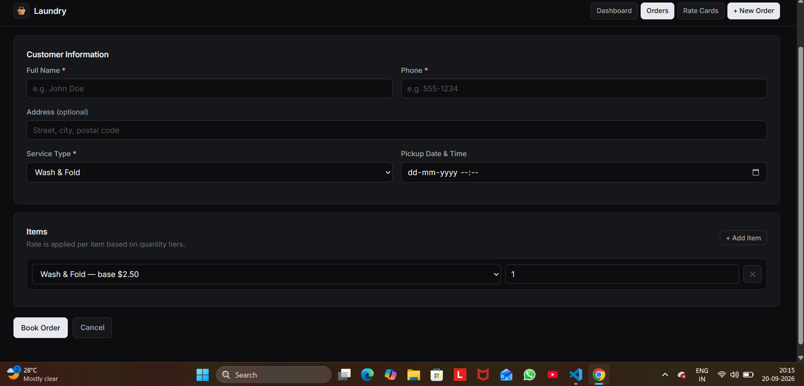
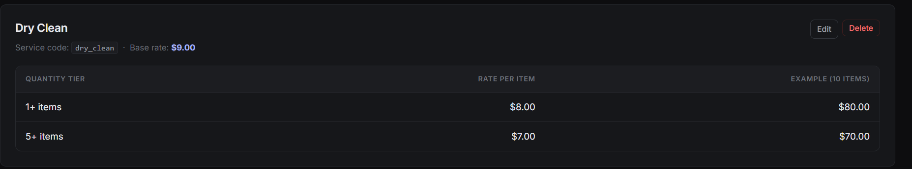
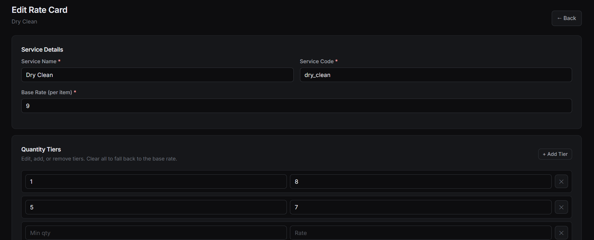
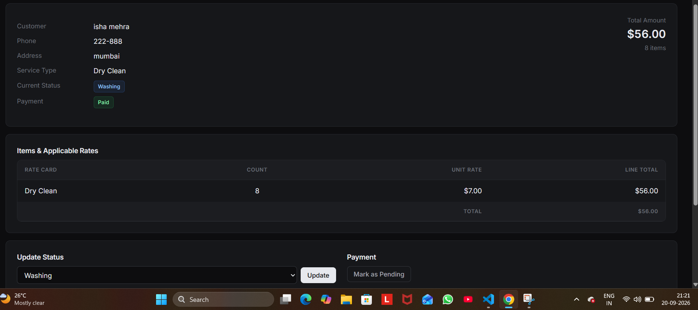
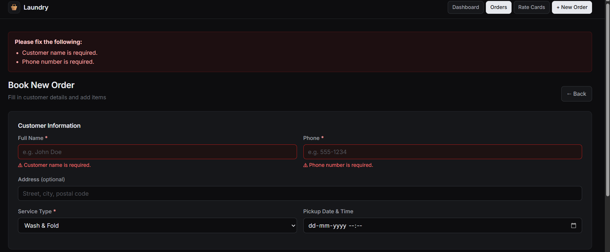

# 🧺 Laundry Management System

A Laravel-based laundry order management system that handles order booking with item counts and service types, applies quantity-based tiered pricing through rate cards, and tracks every order through pickup → washing → ready → delivered stages.

Built as a reference implementation for a full-stack case study: **"Book orders with item count, service type, and applicable rate. Track pickup, washing, and delivery status. Teach rate cards and quantity-based billing."**

---

## 📋 Table of Contents

- [Features](#-features)
- [Screenshots](#-screenshots)
- [Tech Stack](#-tech-stack)
- [Requirements](#-requirements)
- [Installation](#-installation)
- [Environment Setup](#-environment-setup)
- [Database Setup](#-database-setup)
- [Running the Application](#-running-the-application)
- [Project Structure](#-project-structure)
- [How It Works](#-how-it-works)
- [Case Study Mapping](#-case-study-mapping)
- [Routes Reference](#-routes-reference)
- [Rate Card Tiers Explained](#-rate-card-tiers-explained)
- [Troubleshooting](#-troubleshooting)
- [Roadmap](#-roadmap)
- [License](#-license)

---

## ✨ Features

### Order Management
- **Book orders** with customer details, service type, pickup schedule, and multiple items
- **Multiple items per order** with individual counts
- **Automatic rate application** — tiered pricing is calculated per item based on quantity
- **Unique order numbers** generated automatically (`ORD-XXXXXXXXXXXX`)
- **Total amount** computed and stored at booking time

### Rate Cards
- Manage services like *Wash & Fold*, *Dry Clean*, *Iron Only* from the browser
- **Quantity-based tiered pricing** — e.g. 1+ items at $2.50, 10+ items at $2.00, 25+ items at $1.50
- **Base rate fallback** for quantities below the first tier
- **CRUD interface** — create, edit, delete rate cards
- **Delete protection** — rate cards in use by orders cannot be deleted

### Status Tracking
- Four-stage lifecycle: **Pickup → Washing → Ready → Delivered**
- **Timestamped timeline** — every stage transition is recorded
- **Washing complete** action for fine-grained tracking
- Status badges with color coding across all views

### Payments
- Mark orders as **Paid** or **Pending**
- Payment status visible in list, dashboard, and detail views

### Dashboard
- Today's pickups count
- Orders currently in washing
- Orders ready for delivery
- Today's deliveries
- Unpaid balance total
- Revenue for the last 7 days
- Clickable pipeline tiles for each status
- Recent orders table

### Search & Filter
- Search orders by **order number**, **customer name**, or **phone**
- Filter by **status** using tab navigation
- Combined search + filter supported

### UI/UX
- Clean, dark, full-width interface
- Inline form validation with field-level error messages
- Empty states with helpful call-to-action
- Active nav state for current section
- Responsive layout

---

## 📸 Screenshots

> **Note:** Add your screenshots to `docs/screenshots/` and update the paths below.

### Dashboard
Overview of operations with live counts, revenue, and recent activity.




### Orders List
Filter orders by status using tabs. Each row shows order number, customer, service, item count, status, payment, and total.



### Book New Order
Multi-item booking form with customer details, service type, pickup scheduling, and dynamic item rows.




### Rate Cards
Manage services and quantity-based pricing tiers.



### Create/Edit Rate Card
Define a service and add multiple quantity tiers.



### Quantity-Based Billing in Action
Example order showing tiered rates applied automatically:

| Rate Card | Count | Unit Rate | Line Total |
|---|---|---|---|
| Wash & Fold | 5 | $2.50 (base) | $12.50 |
| Wash & Fold | 10 | $2.00 (tier 2) | $20.00 |
| Wash & Fold | 30 | $1.50 (tier 3) | $45.00 |
| **Total** | **45** | | **$77.50** |



### Form Validation
Inline validation with field-level feedback.



---

## 🛠 Tech Stack

| Layer | Technology |
|---|---|
| **Framework** | Laravel 11 |
| **Language** | PHP 8.3 |
| **Database** | PostgreSQL (Neon cloud) |
| **Frontend** | Blade templates, vanilla CSS, vanilla JS |
| **Font** | Inter (Google Fonts) |
| **Server** | `php artisan serve` (dev) |
| **Package Manager** | Composer |

---

## 📦 Requirements

- **PHP** >= 8.2
- **Composer** >= 2.x
- **PostgreSQL** (local or cloud — this project uses [Neon](https://neon.tech))
- **Node.js** >= 18 (optional — only needed if you add Vite assets)
- **PHP extensions**:
  - `pdo_pgsql`
  - `pgsql`
  - `mbstring`
  - `openssl`
  - `tokenizer`
  - `xml`
  - `ctype`
  - `json`

Verify with:
```bash
php -m | grep pgsql
```
## 🚀 Installation

## 1. Clone the repository
```
git clone https://github.com/your-username/laundry-management.git
cd laundry-management
```
## 2. Install PHP dependencies
```
composer install
```
## 3. Copy the environment file
```
cp .env.example .env
```
## 4. Generate an application key
```
php artisan key:generate
```
## php artisan key:generate
```
Run migrations

php artisan migrate
php artisan db:seed --class=RateCardSeeder
php artisan serve

```

## Project Structure

```
laundry-management/
├── app/
│   ├── Http/
│   │   └── Controllers/
│   │       ├── DashboardController.php
│   │       ├── OrderController.php
│   │       └── RateCardController.php
│   └── Models/
│       ├── Order.php
│       ├── OrderItem.php
│       └── RateCard.php
├── database/
│   ├── migrations/
│   │   ├── ..._create_rate_cards_table.php
│   │   ├── ..._create_orders_table.php
│   │   └── ..._create_order_items_table.php
│   └── seeders/
│       └── RateCardSeeder.php
├── resources/
│   └── views/
│       ├── layouts/
│       │   └── app.blade.php
│       ├── dashboard.blade.php
│       ├── orders/
│       │   ├── index.blade.php
│       │   ├── create.blade.php
│       │   └── show.blade.php
│       └── rate-cards/
│           ├── index.blade.php
│           ├── create.blade.php
│           └── edit.blade.php
├── routes/
│   └── web.php
├── docs/
│   └── screenshots/
│       ├── dashboard.png
│       ├── orders-index.png
│       ├── order-create.png
│       ├── order-show.png
│       ├── rate-cards.png
│       ├── rate-card-create.png
│       ├── tiered-billing.png
│       └── validation.png
├── .env.example
└── README.md
```